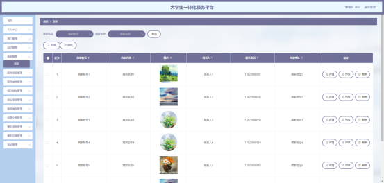
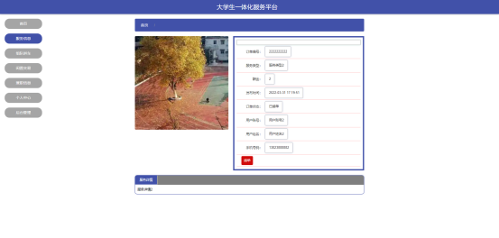

# 基于web的大学生一体化服务平台的设计与实现-优秀毕业设计

---
### 👉作者QQ ：1556708905 微信：zheng0123Long (支持定制修改、部署调试、定制毕设)

### 👉接网站建设、小程序、H5、APP、各种系统等

---

#### 介绍

基于Web的大学生一体化服务平台是一个为大学生提供全面服务的综合管理系统。该平台集成了多种服务功能，旨在为大学生提供便利的服务和资源，包括服务信息、拼车、闲置物品交易、兼职信息等。系统支持四种角色：管理员、司机、商家和用户。每个角色具有不同的功能模块，以满足其特定的需求和操作要求。

#### 研究背景

二十一世纪互联网的出现，改变了几千年以来人们的生活，不仅仅是生活物资的丰富，还有精神层次的丰富。在互联网诞生之前，地域位置往往是人们思想上不可跨域的鸿沟，信息的传播速度极慢，信息处理的速度和要求还是通过人们骑马或者是信鸽传递，这些信息传递都是不可控制的，中间很有可能丢失，信息的传递水平决定了人们生活的水平。如今大家都在使用互联网软件产品，从内部管理设置计算机管理，提高内部信息化的管理水准，从外部市场也可以用计算机获取相关数据进行处理，如今各行各业已经严重依赖于计算机了。
本课题研究和开发大学生一体化服务平台，让安装在计算机上的该系统变成管理人员的小帮手，提高大学生综合服务信息处理速度，规范大学生综合服务信息处理流程，让管理人员的产出效益更高。

#### 技术栈

后端技术栈：Springboot+Mysql+Maven

前端技术栈：Vue+Html+Css+Javascript+ElementUI

开发工具：Idea+Vscode+Navicate

#### 系统功能介绍

管理员角色  
个人中心：管理员可以管理自己的个人信息，修改密码，查看操作记录等。  
用户管理：管理平台上的所有用户信息，包括注册、删除和修改用户资料。  
司机管理：管理平台上的司机信息，包括审核司机注册、管理司机资质等。  
商家管理：管理平台上的商家信息，包括审核商家注册、管理商家资质等。  
服务信息管理：管理系统中的各种服务信息，包括服务类型、服务内容等。   
服务接单管理：监督和管理服务订单，包括订单的接单、处理和完成状态。  
组队拼车管理：管理平台上的拼车服务，包括创建拼车活动、管理拼车信息等。  
拼车信息管理：跟踪和管理拼车信息，包括拼车时间、地点、参与者等。  
服务类型管理：管理系统中的服务类型，包括添加、修改和删除服务类型。  
闲置交易管理：管理平台上的闲置物品交易信息，包括审核交易信息、管理交易状态等。  
兼职信息管理：管理兼职信息，包括发布兼职岗位、审核兼职信息等。  
兼职应聘管理：管理兼职应聘信息，包括审核应聘申请、跟踪应聘状态等。  
系统管理：系统的整体配置和管理，包括权限设置、系统维护等。  

司机角色  
服务信息：查看和管理平台上提供的服务信息，包括服务内容和相关条款。  
组队拼车：参与和管理拼车活动，包括创建拼车活动和加入其他司机的拼车活动。  
闲置交易：查看和发布闲置物品交易信息，包括闲置物品的买卖和交换。  
兼职信息：查看和申请兼职信息，包括寻找适合自己的兼职岗位。  
个人中心：管理个人信息，修改密码，查看个人操作记录等。  
后台管理：  
组队拼车管理：管理自己参与的拼车活动，调整拼车安排。  
拼车信息管理：管理和更新拼车信息，确保信息的准确性和及时性。  

商家角色  
服务信息：查看和管理平台上的服务信息，包括发布和修改服务信息。  
组队拼车：参与和管理拼车活动，包括创建拼车活动和加入其他商家的拼车活动。  
闲置交易：查看和发布闲置物品交易信息，包括闲置物品的买卖和交换。  
兼职信息：查看和发布兼职信息，包括招聘兼职岗位和管理兼职申请。  
个人中心：管理个人信息，修改密码，查看个人操作记录等。  
后台管理：  
兼职信息管理：管理发布的兼职信息，包括审核和调整兼职信息。  
兼职应聘管理：管理兼职应聘信息，包括审核应聘申请和跟踪应聘状态。  

用户角色  
服务信息：查看平台上的服务信息，包括获取服务详情和相关内容。  
组队拼车：参与和管理拼车活动，包括搜索拼车信息和加入拼车活动。  
闲置交易：查看和发布闲置物品交易信息，包括购买和出售闲置物品。  
兼职信息：查看和申请兼职信息，包括查找适合自己的兼职岗位。  
个人中心：管理个人信息，修改密码，查看个人操作记录等。  
后台管理：  
服务信息管理：管理自己发布的服务信息，包括修改和删除服务内容。  
服务接单管理：管理服务订单，包括接单、跟踪和完成订单状态。  
拼车信息管理：管理拼车信息，包括创建和更新拼车活动。  
闲置交易管理：管理闲置物品交易信息，包括发布和处理交易请求。  
兼职应聘管理：管理兼职应聘信息，包括提交和跟踪兼职申请。  

#### 功能需求

大学生一体化服务平台根据使用权限的角度进行功能分析，并运用用例图来展示各个权限需要操作的功能。
管理员权限操作的功能包括用户管理，司机管理，商家管理，服务信息管理，服务接单管理，组队拼车管理，拼车信息管理，服务类型管理，闲置交易管理，兼职信息管理，兼职应聘管理等。

司机权限操作的功能包括增删改查组队拼车信息，管理拼车信息。

商家权限操作的功能包括增删改查兼职信息，下载应聘简历，管理兼职应聘信息等。

用户权限操作的功能包括对服务接单，可以参与拼车，可以应聘兼职，可以管理服务信息，管理闲置交易信息，查看服务接单信息以及兼职应聘信息等。

#### 系统流程

大学生一体化服务平台投入使用后，使用者如果能看到相应的流程操作图会提高程序的理解能力。

操作流程

使用者在操作大学生一体化服务平台中，应该按照本系统提供的操作流程进行操作，可以减少操作失误，从而节省进入大学生一体化服务平台的时间。

登录流程

大学生一体化服务平台通过登录功能引导使用者进入指定的功能操作区，也避免非本系统的用户享受本系统提供的服务以及查看本系统提供的信息，进而保证用户安全。

#### 系统作用

该一体化服务平台在以下方面发挥了重要作用：

整合多种服务：将服务信息、拼车、闲置交易和兼职信息整合在一个平台中，提高了服务的便捷性和全面性。  
提高用户便利性：用户可以通过平台快速获取所需服务和信息，节省时间和精力。  
优化资源配置：通过系统管理功能，优化了服务资源的配置，提高了资源利用率。   
促进信息交流：提供了多种交流和互动功能，促进了商家、司机、用户之间的信息流通和沟通。  
增强服务效率：通过系统化管理，提高了服务的处理效率和准确性，提升了用户体验。  

#### 系统功能截图

司机管理

在司机管理界面中包含了司机信息的司机姓名，联系电话，车牌号，司机账号等信息，管理员修改司机，删除司机信息等。

商家管理

商家信息有联系电话，商家地址，商家名称等信息，管理员修改商家，新增商家等。

用户管理

用户信息有性别，手机号码，头像，用户姓名，用户账号等信息，管理员修改用户，删除需要删除的用户等。

组队拼车管理

该管理实现了司机录入组队拼车信息，组队拼车信息包括出发地点，单人费用，座位数，到达地点，联系电话等信息，登记有错误的组队拼车信息也能让司机进行修改，同时也能删除需要删除的组队拼车信息。

拼车信息管理

该管理实现了司机在拼车信息管理界面中查看拼车信息详细信息，查看用户姓名和手机号以及是否支付拼车订单。

兼职信息管理

该管理实现了商家登记兼职信息，兼职信息包括工作地点，工作时间，薪资待遇，岗位名称等信息，商家对兼职信息可以查询，更改等。

兼职应聘管理

该管理实现了商家下载用户的应聘简历，审核用户的应聘信息，查看兼职应聘详细信息等

服务信息

用户可以对未接单的服务进行接单，可以查看服务详细内容等。

组队拼车

用户可以通过该模块查看组队拼车信息，用户点击拼车按钮就能提交拼车信息

兼职信息

用户可以通过该模块查看兼职岗位信息，招聘人数信息以及薪资待遇信息等，用户可以通过应聘来投递个人简历。

闲置交易管理

用户在后台的闲置交易管理界面对闲置物品进行发布，更改，删除等。

拼车信息管理

用户在后台的拼车信息管理界面对提交的拼车订单进行支付，同时对拼车信息明细进行查看。

#### 总结

基于Web的大学生一体化服务平台是一款功能全面、用户友好的综合性管理系统。它不仅解决了大学生在日常生活中面临的多种服务需求，还通过系统化管理提升了服务的效率和质量。然而，随着技术的进步和需求的变化，系统在功能扩展、用户体验优化等方面仍需不断改进。未来，可以结合人工智能、大数据分析等先进技术，进一步提升系统的智能化水平和服务能力。

#### 使用说明

创建数据库，执行数据库脚本 修改jdbc数据库连接参数 下载安装maven依赖jar 启动idea中的springboot项目

后台地址
http://localhost:8080/springbootsb00r/admin/dist/index.html

管理员  abo 密码 abo

前台地址：http://localhost:8080/springbootsb00r/front/index.html
